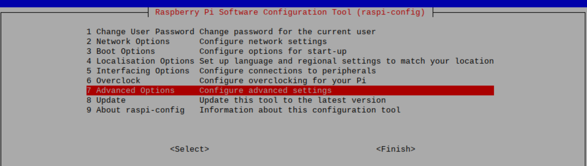
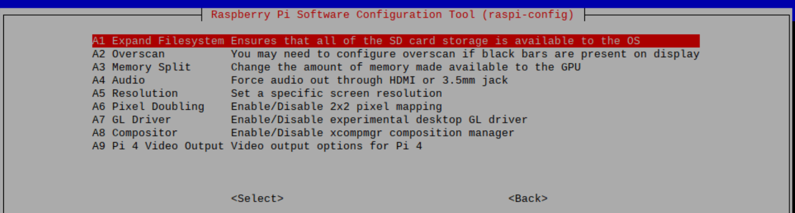
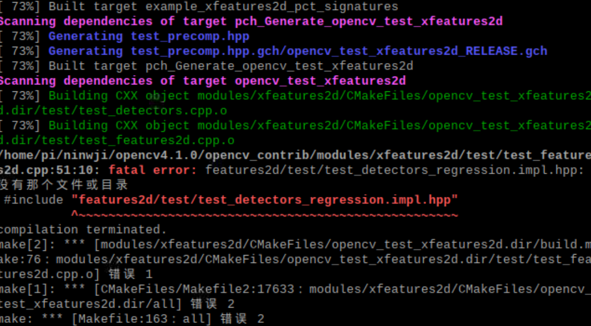
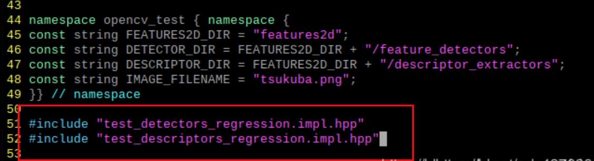
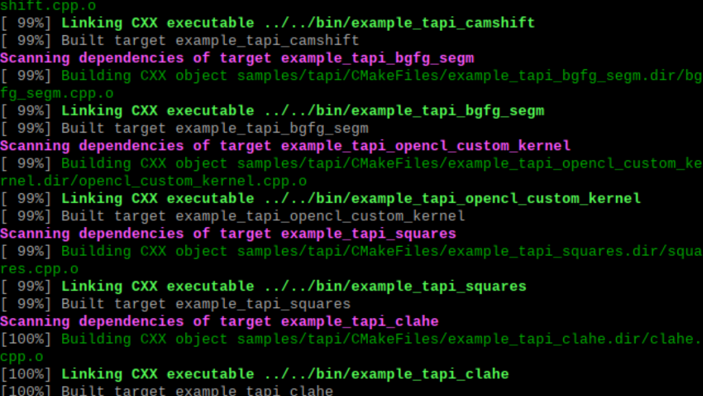

## Install OpenCV 4 onto Raspberry Pi 4B 

#### Overview

This lab is to introduce how to install Open CV4 onto Raspberry Pi 4B. As there has a little bit issue during installation, so tutorials below collect almost all of bugs along with fix solution. Welcome feedback if you find new issues. 

#### Prerequisites 

- Please complete pervious steps [Install Ubuntu 18.04 32bit GUI onto Raspberry Pi 4B](ubuntu/readme.md) 
- Raspberry Pi 4B
- microHDMI2HDMI 
- Display Monitor
- Mouse and Keyboard
- MicroSD card installed ubuntu 18.04 (>16G)
- WLAN or WAN integrated 

#### Tutorials

- Install Python 3.6 

  - `sudo apt-get install python3.6`

- Change package source 

  If you located in China, please change APT source to Ali cloud otherwise not

  * `sudo vim /etc/apt/sources.list`

    

  * Update **ports.ubuntu.com** to **mirrors.aliyun.com**

    ***/ubuntu-ports** regards arm bin, **/ubuntu** regards x86 x64 bin. replace regards your core. Do not need update in this lab*

    `:%s/ports.ubuntu.com/mirrors.aliyun.com/g`

    `:wq`

  * `sudo vim /etc/apt/sources.list.d/raspi.list`

  * Update **ports.ubuntu.com** to **mirrors.aliyun.com**

    ***/ubuntu-ports** regards arm bin, **/ubuntu** regards x86 x64 bin. replace regards your core. Do not need update in this lab*

    `:%s/ports.ubuntu.com/mirrors.aliyun.com/g`

    `:wq`

  * `sudo apt-get update` 

    `sudo apt-get upgrade`

- Expand Filesystem Storage

  - `sudo raspi-config`

  - Select **7. Configure Advanced Setting** 

    

  - Select **A1**  

    

  - `sudo reboot`

- Install Open CV4 dependency package 

  - **Please ensure all of below packages installed successfully**. If met error, just install relevant dependency and do it again. Some of packages may be expired, just install alternative package regards output message. 

    `sudo pip3 install numpy
    sudo apt-get install build-essential git cmake pkg-config -y
    sudo apt-get install libjpeg8-dev -y
    sudo apt-get install libtiff5-dev -y
    sudo apt-get install libjasper-dev -ysudo apt-get install libpng12-dev -y
    sudo apt-get install libavcodec-dev libavformat-dev libswscale-dev libv4l-dev -y
    sudo apt-get install libgtk2.0-dev -y
    sudo apt-get install libatlas-base-dev gfortran -y`

- Download Open CV4 install package

  - `cd /
    cd home/ubuntu/Documents
    sudo mkdir motiondetect
    cd motiondetect`
  - `git clone -b 4.3.0 --recursive https://github.com/opencv/opencv.git
    git clone -b 4.3.0 --recursive https://github.com/opencv/opencv_contrib.git`
  - `cd opencv-4.3.0
    sudo mkdir build
    cd build`

- Setup compile configuration

  - It would take a long period to setup compile configuration, just wait for complete

    `sudo cmake -D CMAKE_BUILD_TYPE=RELEASE \
    -D CMAKE_INSTALL_PREFIX=/usr/local \
    -D INSTALL_C_EXAMPLES=ON \
    -D INSTALL_PYTHON_EXAMPLES=ON \
    -D OPENCV_EXTRA_MODULES_PATH=/home/ubuntu/Documents/motiondetect/opencv_contrib-4.3.0/modules \
    -D BUILD_EXAMPLES=ON \
    -D WITH_LIBV4L=ON \
    -D PYTHON3_EXECUTABLE=/usr/bin/python3.6 \
    -D PYTHON_INCLUDE_DIR=/usr/include/python3.6 \
    -D PYTHON_LIBRARY=/usr/lib/arm-linux-gnueabihf/libpython3.6m.so \
    -D PYTHON3_NUMPY_INCLUDE_DIRS=/usr/lib/python3/dist-packages/numpy/core/include \`

    Once output below then config successfully 

    `Configuring done
    Generating done`

- Start Compile

  - Download and copy folder **missingfiles** from GitHub to Raspberry Pi 4B. Open Bash from our local computer. 

    `scp -r {your local folder}/missingfiles root@{Raspberry Pi IP address}:/home/ubuntu/Documents/motiondetect/`

  - Route to Raspberry Pi 4B console. Copy all of missing files under folder **missingfiles** into **opencv_contrib-4.3.0/modules/xfeatures2d/src/**

    `cd /
    cd home/ubuntu/Documents/motiondetect
    cp missingfiles/*.i opencv_contrib-4.3.0/modules/xfeatures2d/src/`

  - `cd opencv-4.3.0/build
    sudo make`

  - When you met issue below

    

    - Copy 2 files from **opencv-4.3.0/modules/features2d\test** to **opencv_contrib-4.3.0/modules/xfeatures2d/test**

      `cp home/ubuntu/Documents/motiondetect/opencv-4.3.0/modules/features2d/test/test_descriptors_regression.cpp home/ubuntu/Documents/motiont/opencv_contrib-4.3.0/modules/xfeatures2d/test/`

      `cp home/ubuntu/Documents/motiondetect/opencv-4.3.0/modules/features2d/test/test_detectors_regression.cpp home/ubuntu/Documents/motiont/opencv_contrib-4.3.0/modules/xfeatures2d/test/`

    - Update CPP reference file as below

      `sudo nano home/ubuntu/Documents/motiondetect/opencv_contrib-4.3.0/modules/xfeatures2d/test/test_feature2d.cpp`

      

    - After update **#include** reference, save file with `Ctrl + O` and `Ctrl + X`

    - If you met similar lack files, just do this step again with missing files. 

  - Compile Successfully

    

  - Start Install 

    `sudo make install`

  - Verity

    `python3
    import cv2`

    if no error output, then install Open CV4 successfully onto Raspberry Pi 4B! 