# Motion Face Detect by Raspberry PI 4B

This lab is to introduce a solution regards use OpenCV 4 to detect and recognize person when motion detect happen. Application on Raspberry Pi 4b will send transaction message to Azure IOT HUB, then send notification to Microsoft Teams by Azure Logic App which trigger Azure Event Hub message from Azure IOT HUB.

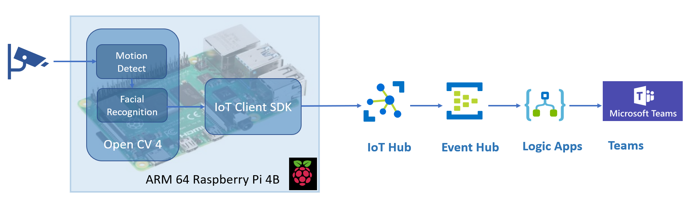

#### Prerequisites

- Download this lab folder as Zip and Unzip to your local folder. 
- An Azure account with an active subscription. [Create an account for free](https://azure.microsoft.com/free/?WT.mc_id=A261C142F).
- [Visual Studio Code](https://code.visualstudio.com/) on your machine with [Azure IoT Tools extension](https://marketplace.visualstudio.com/items?itemName=vsciot-vscode.azure-iot-tools).
- [Install Ubuntu 18.04 32bit GUI onto Raspberry Pi 4B](ubuntu/readme.md)
- [install Open CV4 onto Raspberry Pi 4B](opencv/readme.md)

#### Tutorials

- Configure Azure Resource Group

  - Login in [Azure Portal](https://ms.portal.azure.com/) with your azure account. 

  - Click **Create a resource** in Azure portal left panel 

  - Search resource group and create a new resource group with {Your Resource Group Name}

    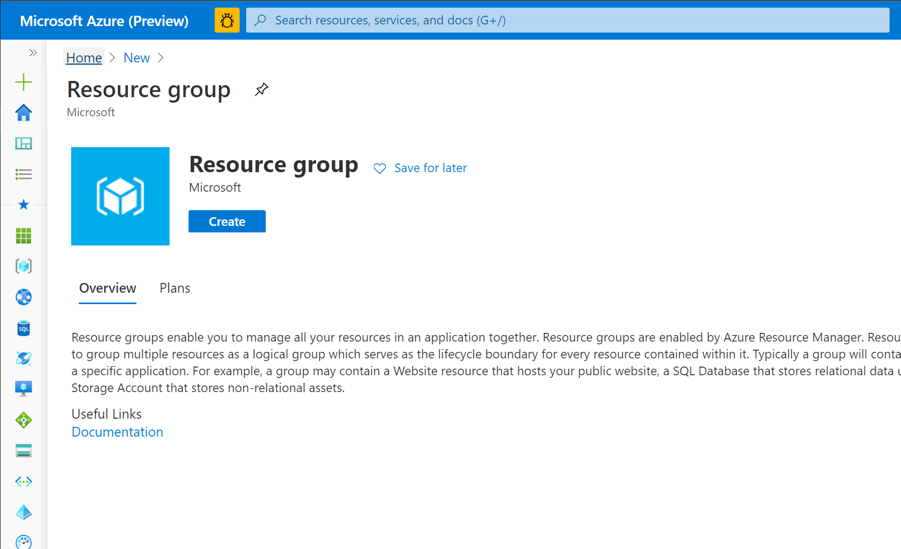

- Configure Azure IoT Hub

  - Click **Create a resource** in Azure portal left panel

  - Search IoT Hub and create a new Azure IoT Hub with {Your Resource Group Name} and {Your IoT Hub name}

    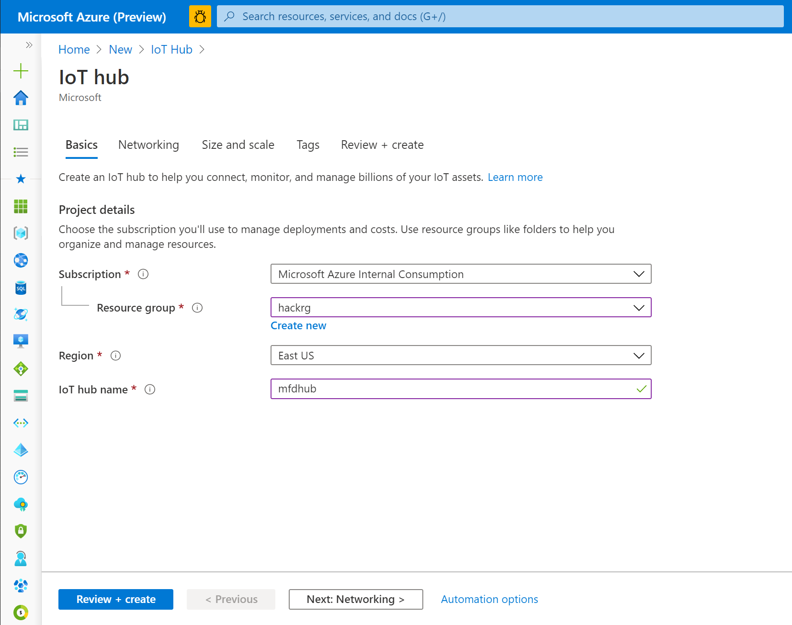

- Config IOT HUB to route telemetry message to event hub

  - Configure Azure Event Hub 

    - Click **Create a resource** in Azure portal left panel 

    - Search and create a new **Event Hubs** with name **{Your Event Hubs Name}** under **{Your Resource Group}** created at previous step 

    - From **Event Hubs** left panel, create a new **Event Hub** with name **{Your Event Hub Name}**

      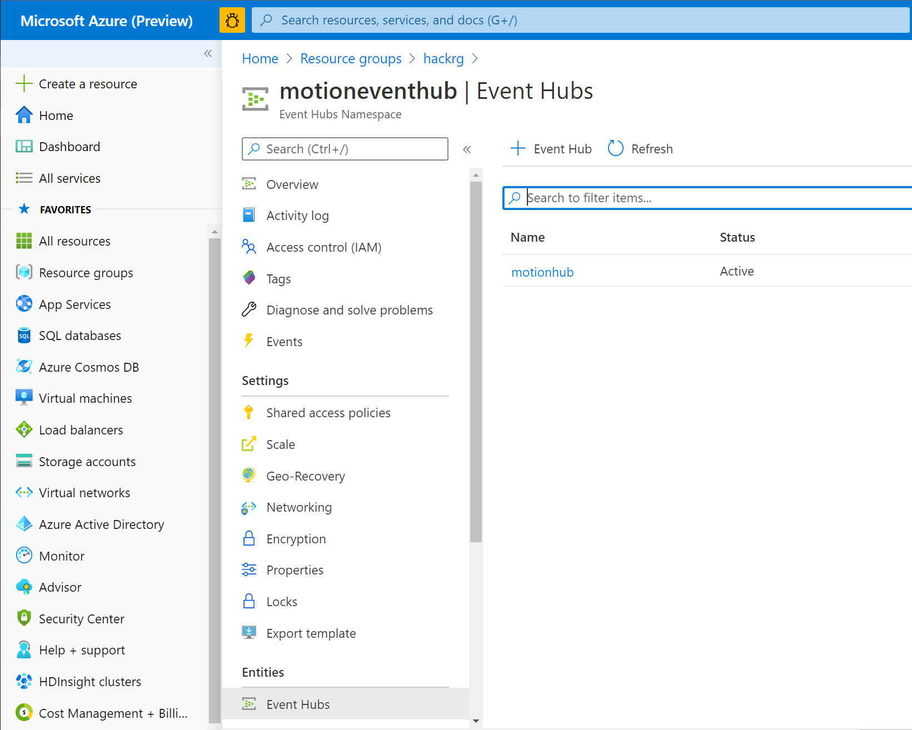

    - Open IOT HUB **{Your IoT Hub name}** under resources group **{Your Resource Group Name}**, and click **Message routing ** in left panel

      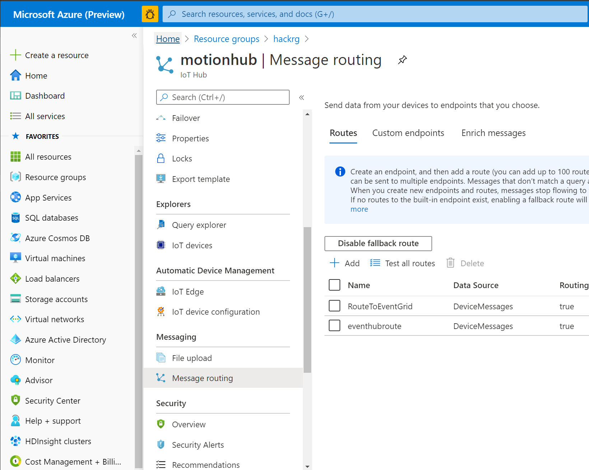

    - Click **Add** to create a new **event hub endpoint**, and entry **{Your Route Name}**, and select event hub endpoint **{Your Event Hub Name}** 

      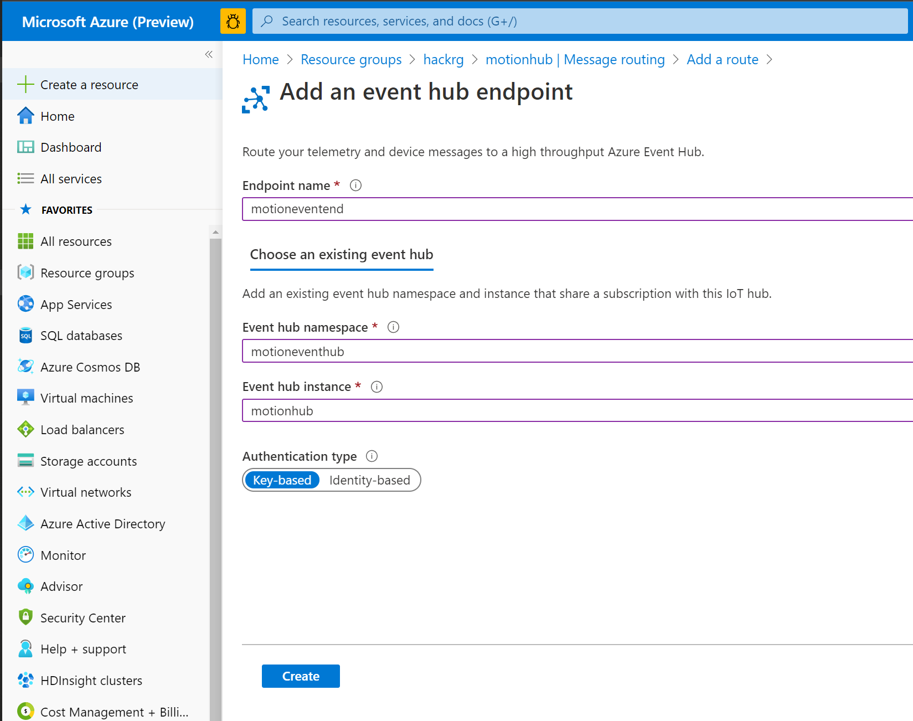

    - Click **Create**

- Configure Azure Logic App to trigger event hub message and route to **Microsoft Teams**

  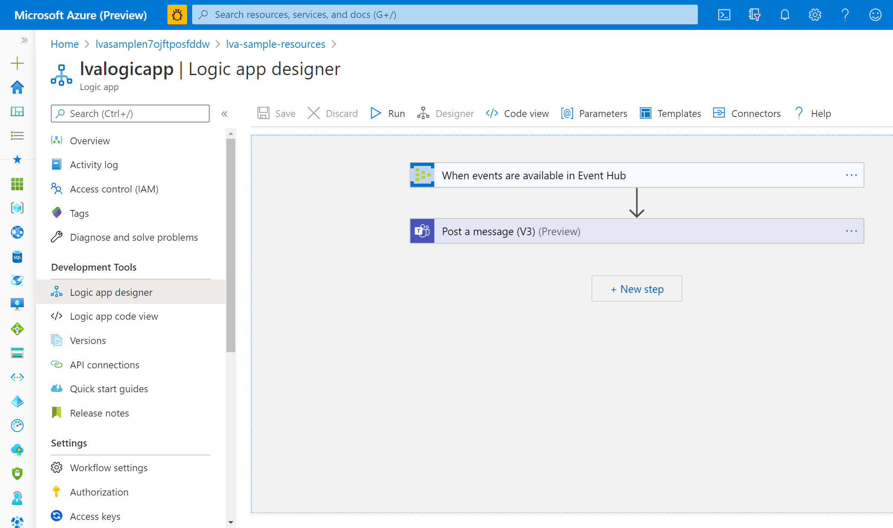

  - Create a new Logic App names **{Your Logic Apps Name}** under resources group **{Your Resource Group Name}** from Azure portal

  - Create a **Blank Logic App** at output design panel. 

  - Select input trigger with action **When events are available in Event Hub**, and select event hub **{Your IoT Hub name}** you created in pervious step 

    - select **text/plain** in **Content Type** section

  - Select next action with **Microsoft Teams** and select method **Post a message (V3) (Preview)** 

    You might need sign in teams with your azure account from output window

  - Select **Microsoft Teams** Channel you want to post and select Content into **Message** panel.

    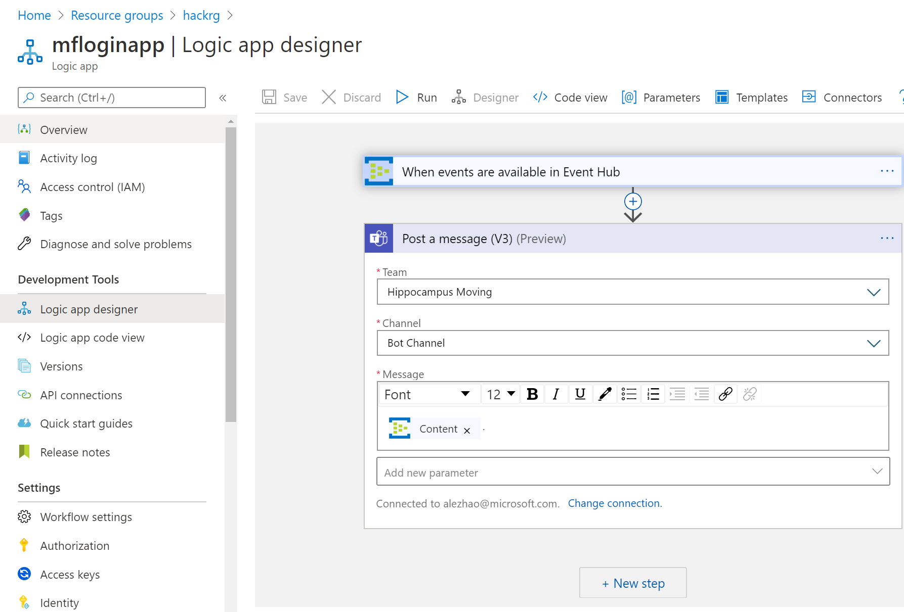

- Configure motion detect and facial recognition script onto Raspberry Pi 

  - Open IOT HUB **{Your IoT Hub name}** under resources group **{Your Resource Group Name}**, and click **Shared access policies ** in left panel

    - Click **iothubowner** and Copy **Connection string--primary key** from output panel to notepad

      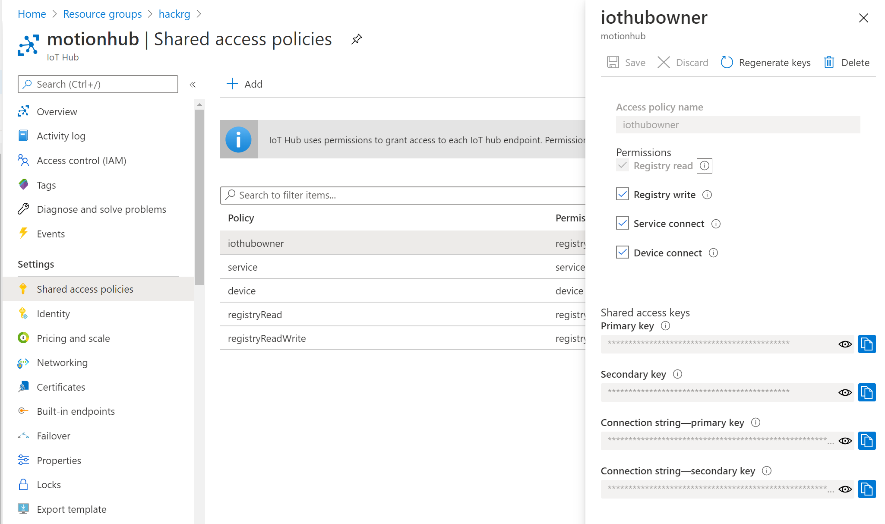

  - Right click script **motionfacetrain.py** in **scripts** folder and select open by VS code

    - Replace {Azure IoT Hub Connection String} with **Connection string--primary key** from notepad

      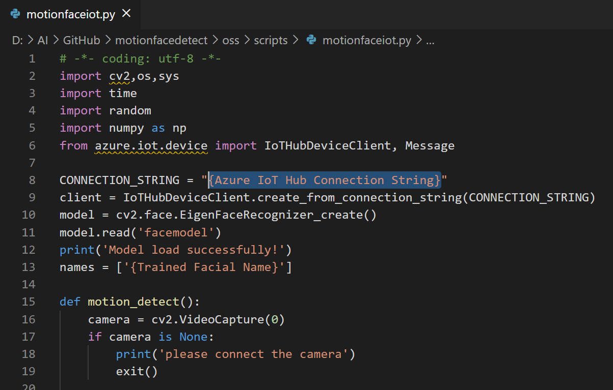

  - Open **Bash or Terminal** on your local computer. 

  - Copy all of python files in **scripts** folder onto your Raspberry Pi which create by step [Install Ubuntu 18.04 32bit GUI onto Raspberry Pi 4B](ubuntu/readme.md) 

    - `scp {Your Local Folder}/scripts/*.* root@{Raspberry Pi IP address}:/home/ubuntu/Documents/motiondetect/`

  - SSH login your Raspberry Pi 

  - Install Azure IoT Hub runtime SDK

    - `sudo pip3 install azure-iot-device`

  - Verify your camera 

    - `cheese` check if open camera without issue or not.

  - `cd /`

  - `cd home/ubuntu/Documents/motiondetect`

  - `sudo mkdir train`

  - Generate your face feature to prepare to train your face model

    - `Python3 generate_face_from_video.py`
    - Wait camera open and show rectangle of your face, turn left and turn right your face to let script generate your face features. Keep stay by 10 seconds. 

  - Train your face model 

    1. `Python3 motionfacetrain.py`

    2. Wait for training complete

       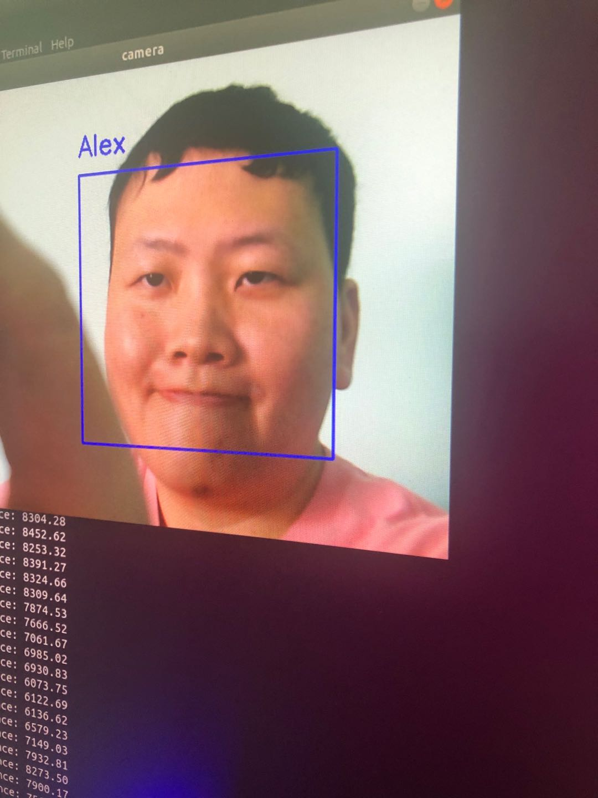

- Verify

  - Verify by Raspberry Pi Camera, it should detect facial recognition once motion detected

  - `Python3 motionfacetrain.py`

    

  - Verify on Teams Channel.

    