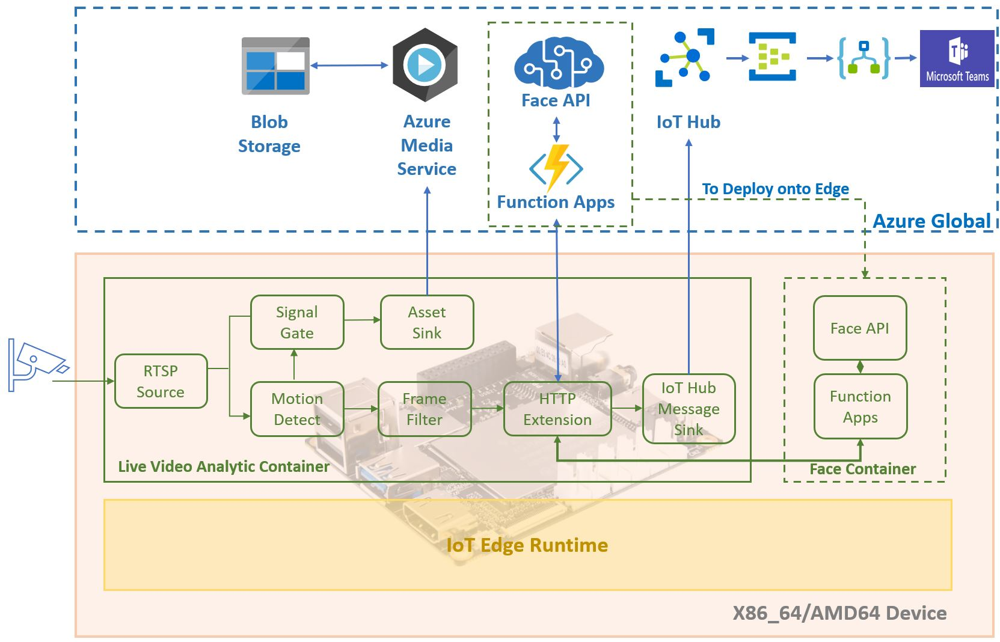

## Motion Face Detect by OSS and Azure Solution

This lab is to introduce solution for remote monitoring on human behavior, once person has movement, the system would detect his motion and do facial detect and recognition, then notify somebody else. The solution is built for Hack for Good to resolve remote care for person who carry Alzheimer. 

OSS solution is a light solution with lower cost which use for single family. 

[Motion Face Detect by Raspberry PI 4B](oss/readme.md)

Azure solution is end to end solution which use for large department.   

[Motion Face Detect by Live Video Analysis and Face API](lva/readme.md)

