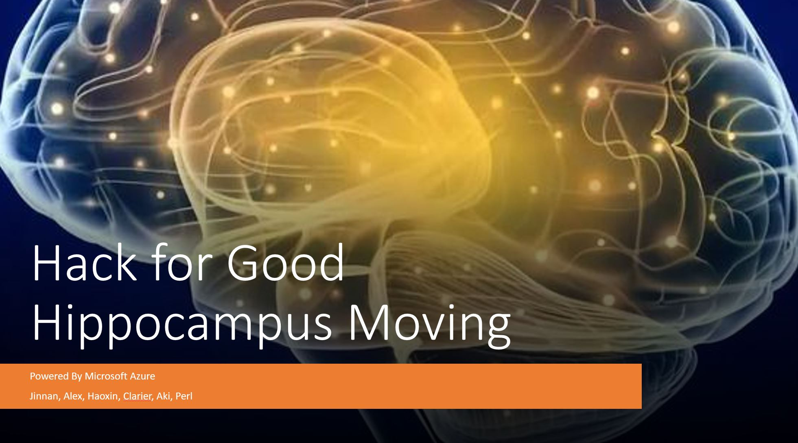
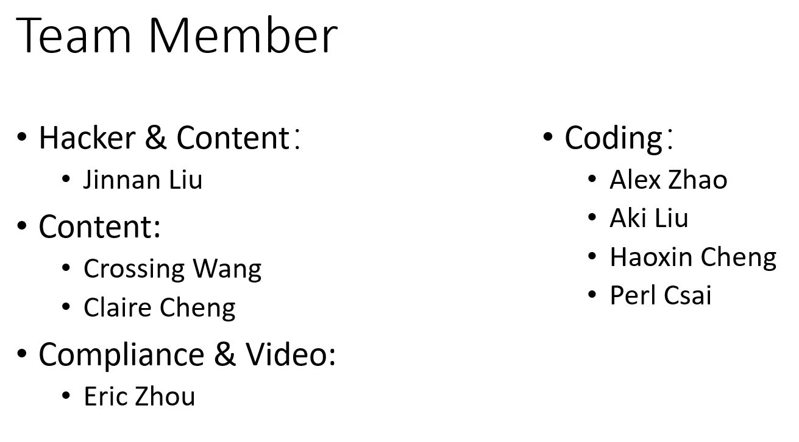

## Hack for Good - Hippocampus Moving

For the whole world, every 3 seconds, there will be an increase in Alzheimer's patients

Over 65 years of age, the incidence of morbidity is 5%; the incidence of over 85 years of age reaches more than 30%, the world is currently estimated at 50 million, and it is estimated that there will be about 130 million AD patients in the world by 2050

Alzheimer's disease is commonly known as Alzheimer's disease, because the hippocampus has lesions, so the patient is also called hippocampus

In the process of treatment, family care is a very important link. They leave home unconsciously and cannot find a way back home. They often have a lot of trouble with the caregiver and the family. . .

#### Overview

This lab is to introduce solution for remote monitoring on human behavior, once person has movement, the system would detect his motion and do facial detect and recognition, then notify somebody else. The solution is built for Hack for Good to resolve remote care for person who carry Alzheimer. 

#### Team Member

#### Solution

OSS solution is a light solution with lower cost which use for single family. 

[Motion Face Detect by Raspberry PI 4B](oss/readme.md)

Azure solution is end to end solution which use for large department.   

[Motion Face Detect by Live Video Analysis and Face API](lva/readme.md)

